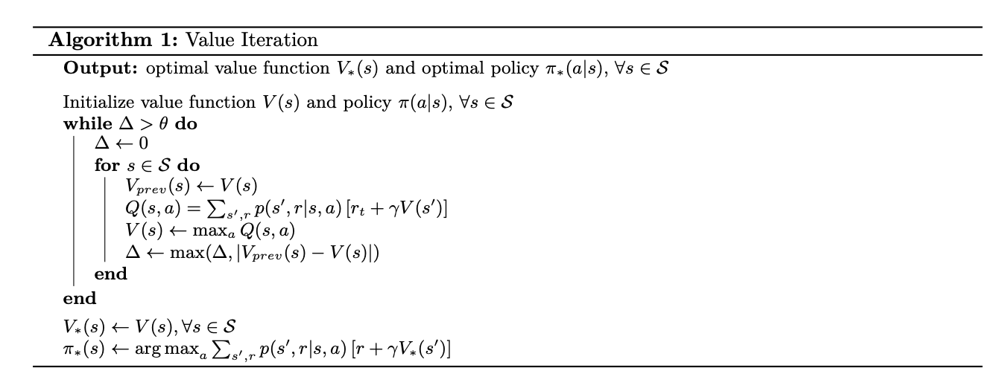
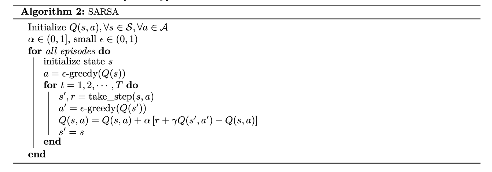
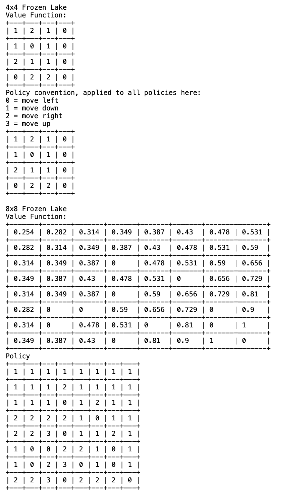
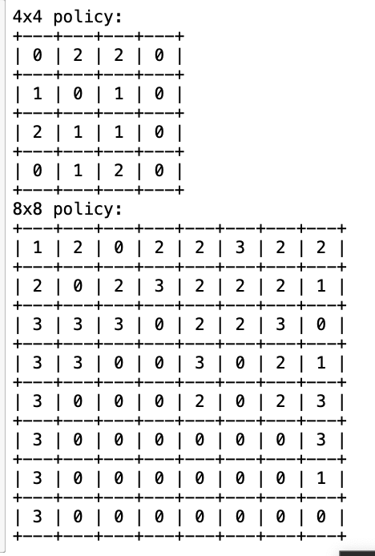
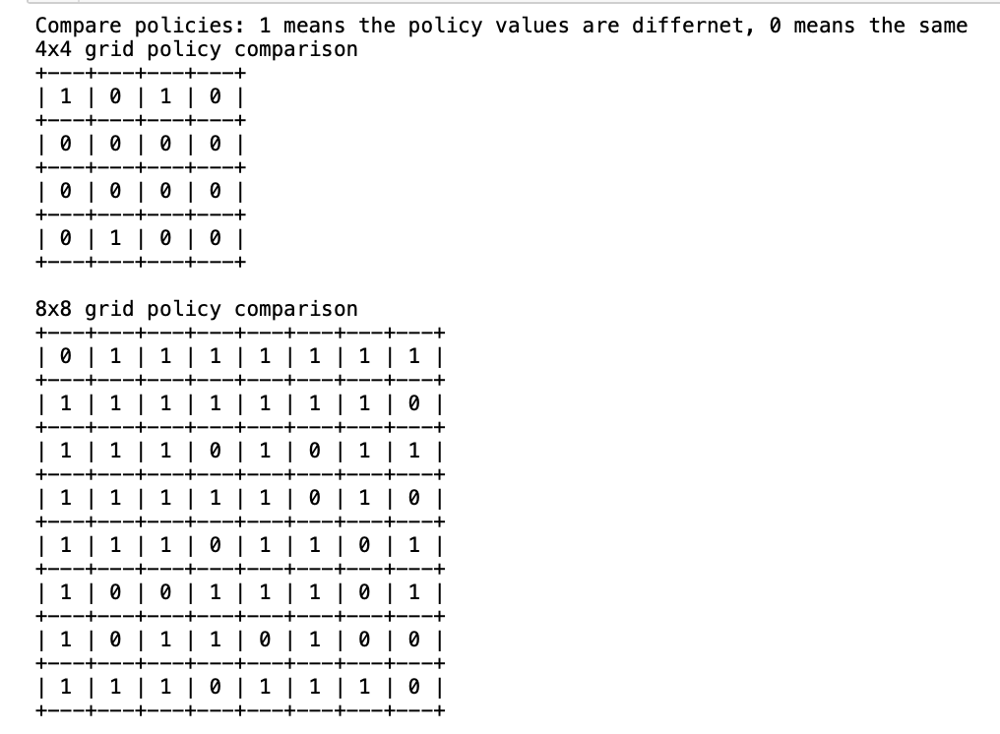

# RL-algorithms
## Value Iteration

I implemented value iteration in the Frozen-Lake environment from OpenAI Gym. The environment is structured as a grid-world, either 4x4 or 8x8 in size. As an agent in this environment, my objective is to navigate through this grid by moving up, down, left, or right. The ultimate goal is to reach a designated point while avoiding any pitfalls, represented as holes in the grid.

In the Frozen-Lake environment, the reward system is straightforward. Successfully reaching the goal earns me a reward of +1. However, if I make a misstep and fall into a hole, I receive a -1 reward. For all other moves that neither result in reaching the goal nor falling into a hole, there's a minimal penalty of -0.1, which represents the cost of each step taken in the environment.
Here is the pseudocode:
# 

## SARSA

In the context of Value Iteration, it's typically assumed that we have knowledge of the environment's transition model, denoted as p(s′,r|s,a). However, there are situations where this model isn't known. In such cases, we turn to a different approach known as model-free Reinforcement Learning (RL). An example of this, which was discussed in the lectures, is the Q-learning algorithm, a form of model-free learning.

For this specific task, I'm focusing on implementing SARSA, another type of model-free method. The SARSA algorithm's methodology is quite intriguing and differs from the Q-learning approach. After completing the implementation, my objective is to analyze and report the final policies developed in both environments.
Here is the pseudocode:
# 

# Results
## Value Iteration
# 

## Sarsa  
# 

## Policy Comparison
# 

